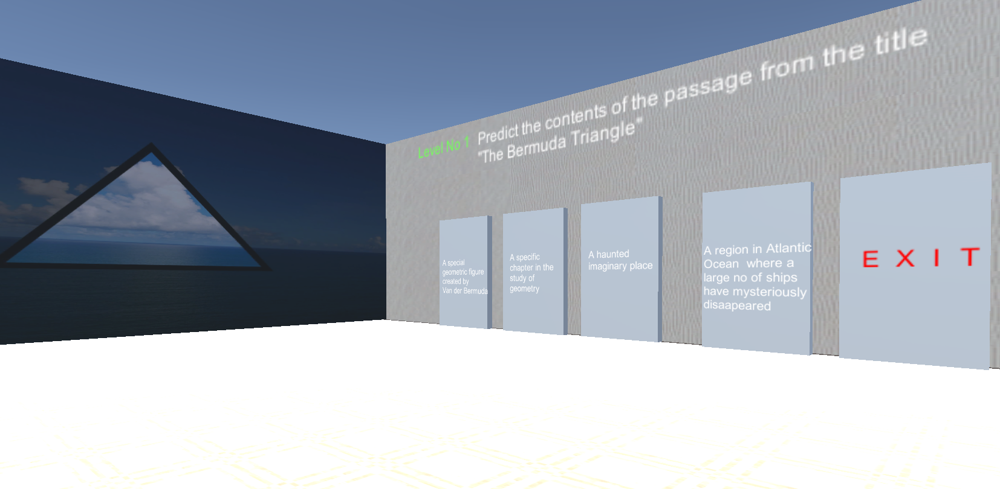
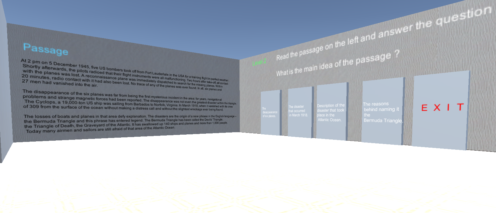
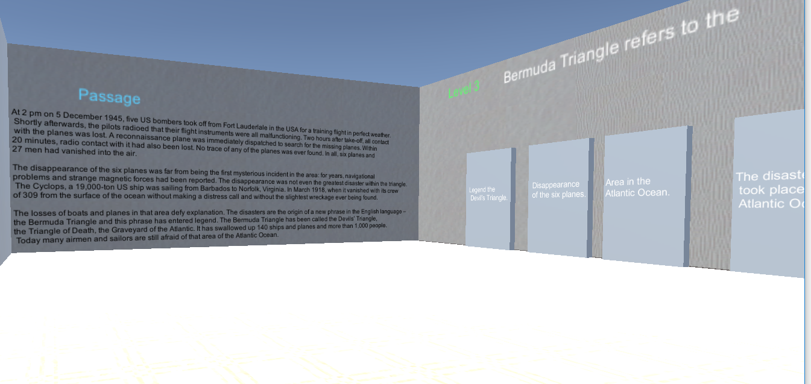
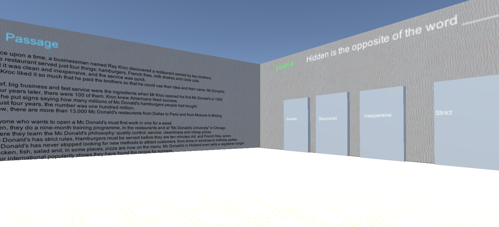

# ALERT ! This is not source code for the game. It is the game.

# Readopoly 📚

This game is designed to facilitate comprehension skills like scanning, skimming, vocabulary etc.
They have to read passages and find hints which may/may not be leading to the answer.
This was a part of PhD Thesis by Dr. Malvika Sharma from Pillai College of Engineering, Panvel

## Getting Started
 
These instructions will get you a copy of the project up and running on your local machine.

### Prerequisites

Reccomended:
```
Latest Copy of Windows (Windows 10 Reccomended)
Graphics Driver (Intel HD Graphics/ Nvidia/ATI Graphics Card)
2 Gb System Memory
Core 2 Duo or any higher grade processor
```

### Installing

Installation is not required


```
Run 'can you break through.exe'
```
You will see a configuration menu for adjusting game specifications to match that of system's


Game Starts with a Menu, click on Start to Load Level 1

### Level1
 

### Level2


### Level3


### Level4



